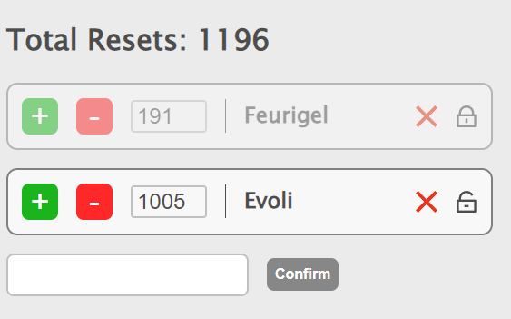

# Pokemon Counter



## Project setup
```
npm install
```

### Compiles and hot-reloads for frontend
```
npm run serve
```

### Compiles and hot-reloads for backend
```
npm run api
```

### Compiles and hot-reloads for frontend and backend
```
npm run dev
```

### Lints and fixes files
```
npm run lint
```

The Node server is reading and writing your json config file.

In order use correctly our json file we need:

``` bash
{
    "pokemons": [
        {
            "name": string,
            "count": int|number,
            "id": int|number,
            "freezed": boolean
        }
    ]
}
```

Checkout pokemon-example.json file inside src directory and create a new copy and name it pokemons.json to use it. The UI can add new Pokemon entries